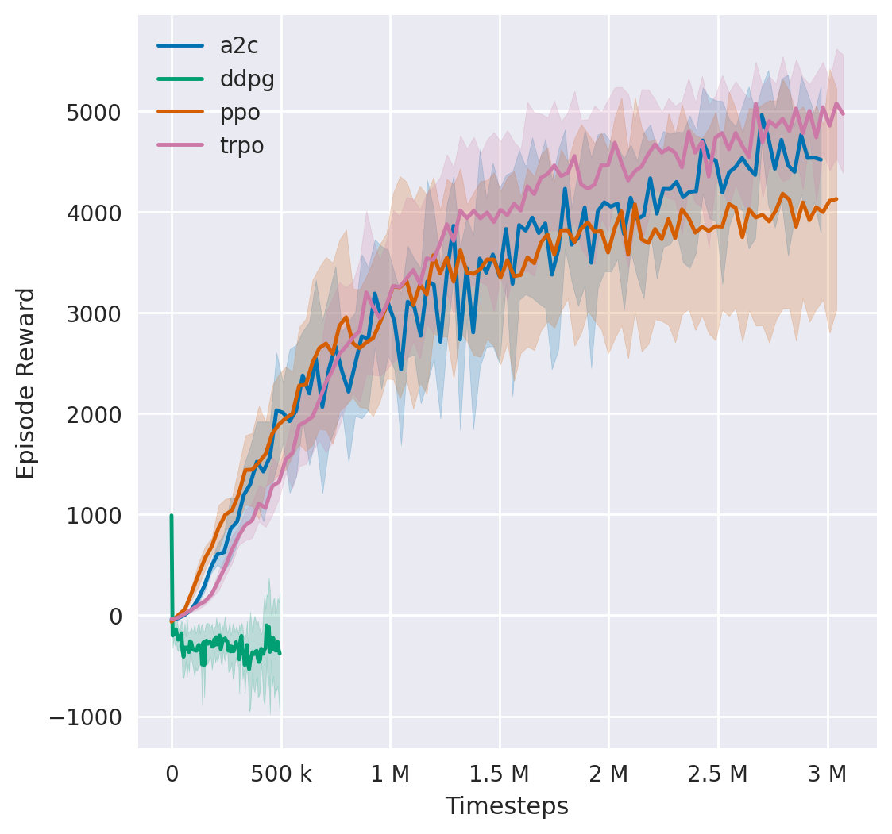

## EnvPool

We highly recommend using envpool to run the following experiments. To install, in a linux machine, type:

```bash
pip install envpool
```

After that, `make_mujoco_env` will automatically switch to envpool's Mujoco env. EnvPool's implementation is much faster (about 2\~3x faster for pure execution speed, 1.5x for overall RL training pipeline in average) than python vectorized env implementation, and it's behavior is consistent to gym's Mujoco env.

For more information, please refer to EnvPool's [GitHub](https://github.com/sail-sg/envpool/) and [Docs](https://envpool.readthedocs.io/en/latest/api/mujoco.html).

## Usage

Run

```bash
$ python mujoco_ppo.py --task Ant-v3
```

Logs is saved in `./log/` and can be monitored with tensorboard.

You can also reproduce the benchmark (e.g. PPO in Ant-v3) with the example script

```bash
$ ./run_experiments.sh Ant-v3 ppo
```

This will start 10 experiments with different seeds.

Now that all the experiments are finished, we can convert all tfevent files into csv files and then try plotting the results.

```bash
# generate csv
$ ./tools.py --root-dir ./results/Ant-v3/ppo
# generate figures
$ ./plotter.py --root-dir ./results/Ant-v3 --shaded-std --legend-pattern "\\w+"
# generate numerical result (support multiple groups: `--root-dir ./` instead of single dir)
$ ./analysis.py --root-dir ./results --norm
```

## Example benchmark



Other graphs can be found under `results/`
